# Movie Club - Online Movie Ticket Booking System

## Description
**Movie Club** is a responsive PHP-based online movie ticket booking system. It simplifies the process of exploring recent movies and booking tickets with just a few clicks. The system provides detailed information about movies, allowing users to make informed decisions. It is designed for users to book tickets anytime and anywhere, offering a seamless and user-friendly experience.

## Features
### General Features
- View detailed information about movies, including:
  - Title, Genre, Release Date
  - Runtime, Director, Cast
  - Brief Overview
- Enquire about recent movies and available showtimes.
- Book movie tickets based on:
  - Theatre type
  - Class type (e.g., Regular, Premium)
- View booking history.

### Admin Panel
- Accessible only by authorized admins via registered username and password.
- Manage movies:
  - Add movies with detailed information.
  - Update or delete existing movies.
- Manage users:
  - View detailed information about registered users.
  - Access user booking history.
  - Update or delete user details.

### User Panel
- **Account Management**:
  - Login with a registered email and password.
  - Register for a new account if not already registered.
- **Movie Booking**:
  - Explore trending films and book tickets.
- **Booking History**:
  - View past ticket bookings in the history section.

## Technologies Used
- **Frontend**: HTML, CSS, JavaScript, Bootstrap
- **Backend**: PHP
- **Database**: MySQL

## Images
### User panel
#### Home Page
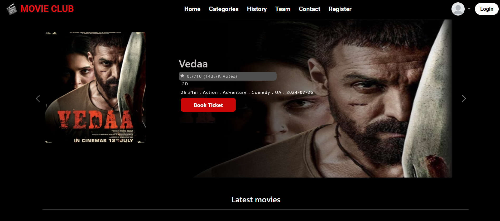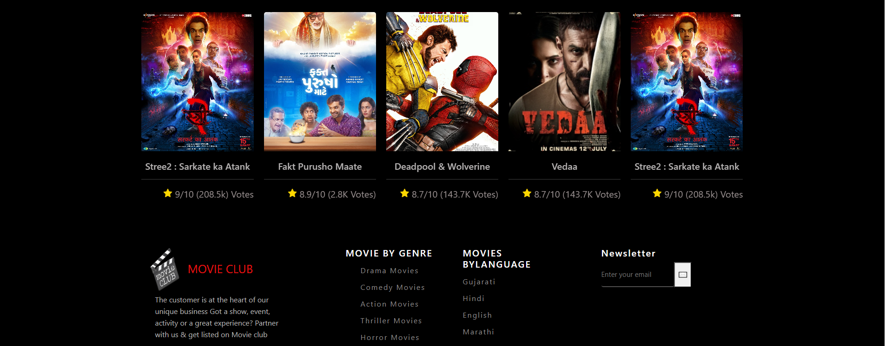

#### Login Page
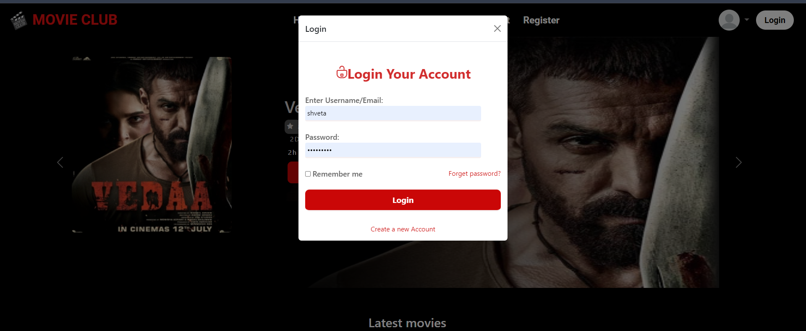

#### Register Page
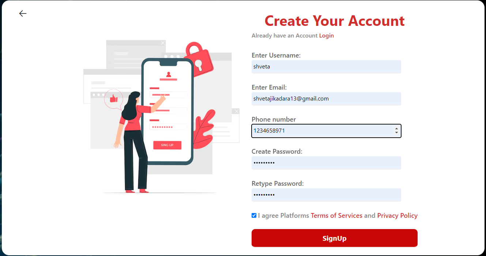

#### Ticket Booking Page
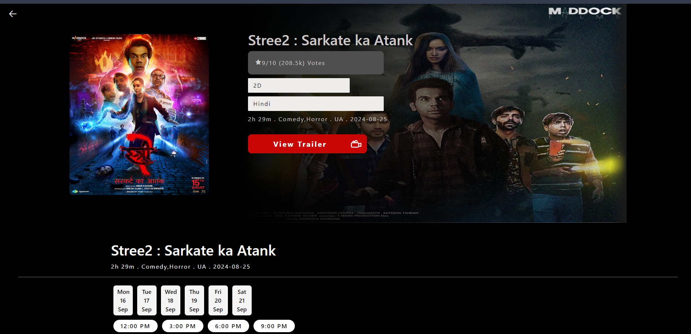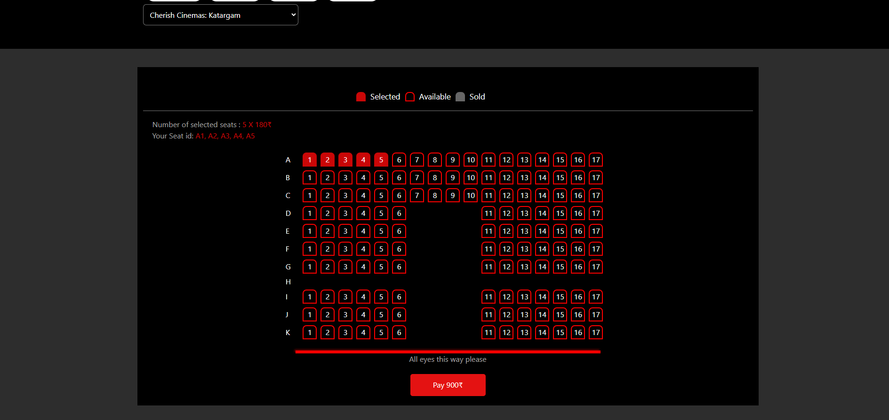

#### Ticket History Page
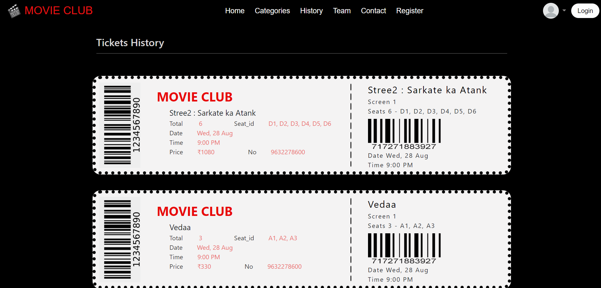

### Admin panel
#### Admin Home Page
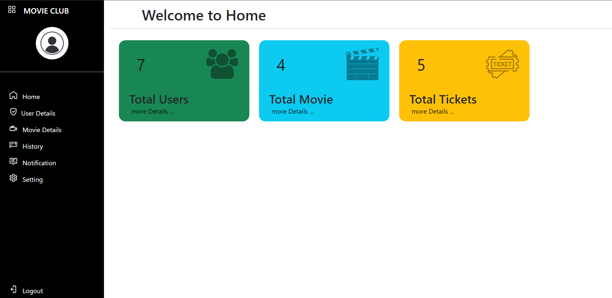

#### User manage Page
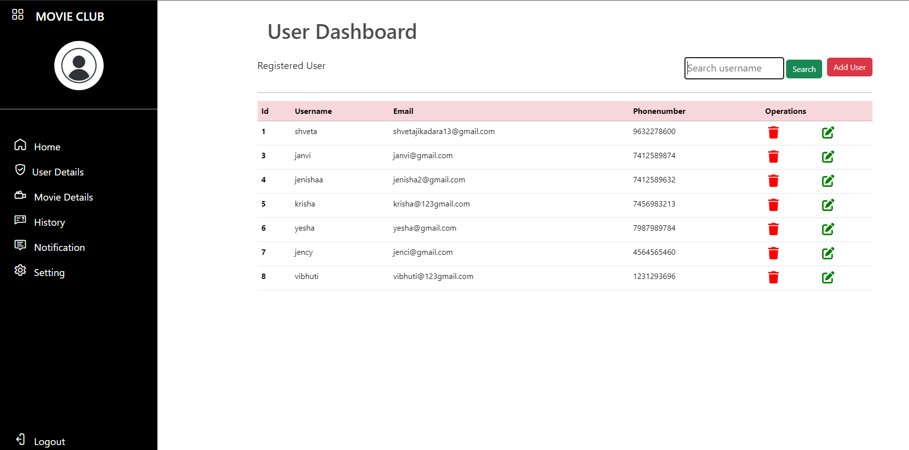

#### Movie ADD Page
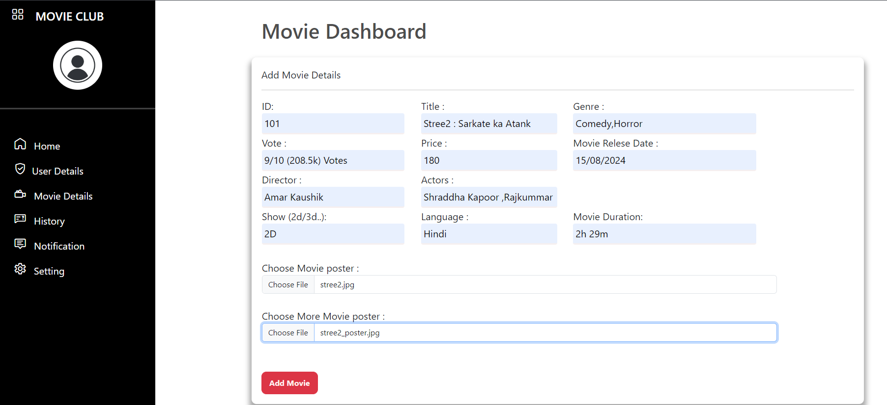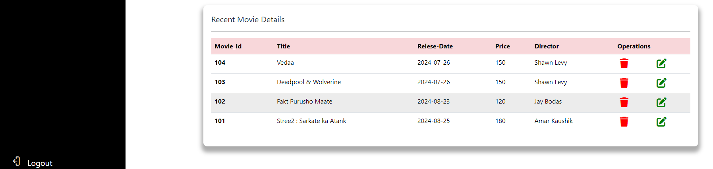  

#### User manage Page

#### Ticket History Page
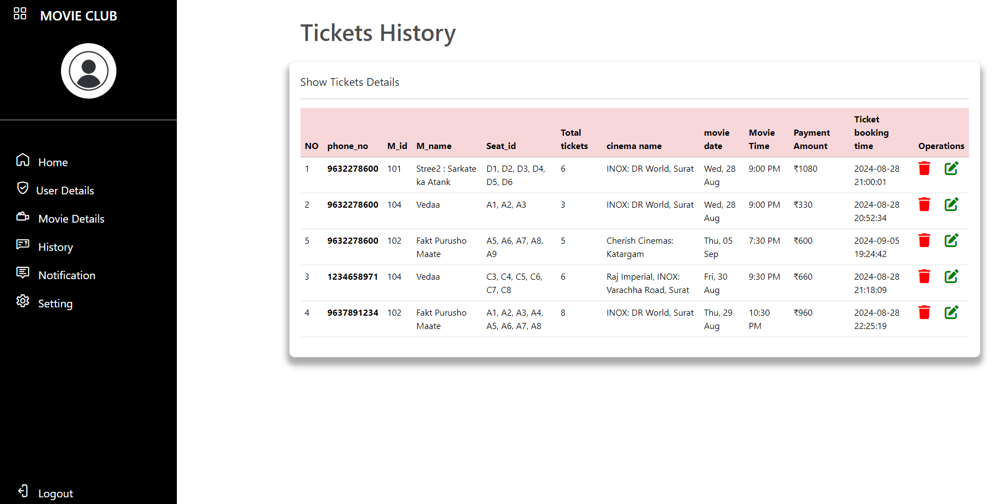
